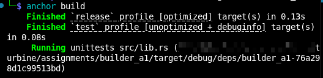
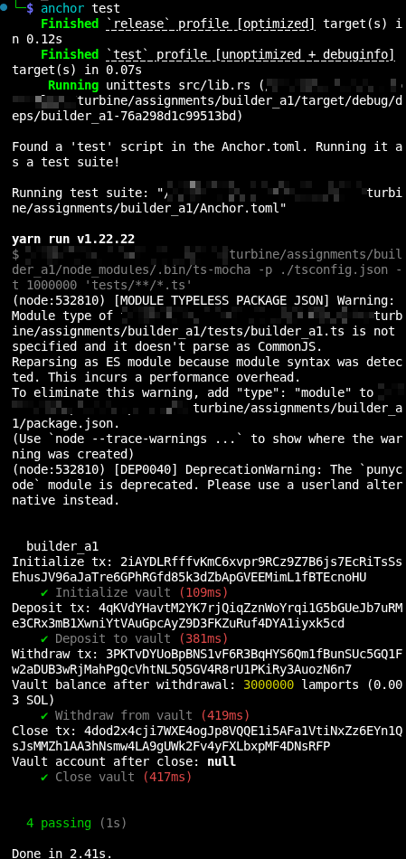

# Builders 1 - Week 3 - Assignment 1

# Anchor Vault

A vault is an account that is controlled by a program, which handles the storing of assets in that account.

It has 4 functionalities:

* initializes the vault account
* able to deposit assets to account
* able to withdraw assets from account
* close account and return all funds to signer

---

# Architecture

```text
programs/builder_a1/src/
├── lib.rs                 
├── state.rs               
├── error.rs               
└── instructions/
    ├── mod.rs
    ├── initialize.rs      
    ├── deposit.rs         
    ├── withdraw.rs        
    └── close.rs           
```

## File Overview

### lib.rs

Main anchor program entry point that declares 4 vault instructions:

* initialize
* deposit
* withdraw
* close

### state.rs

Defines `VaultState` account struct that stores the two bump seeds (`vault_bump` and `state_bump`).

These bumps are then re-used to derive PDA's.

### error.rs

Errors can be customized for later debugging purposes.

---

# Instructions

Contains instructions for vault program.

## instructions/mod.rs

Acts as an entry point module, where all the instructions are re-exported.

## instructions/initialize.rs

Initializes the account struct, store vault and state bumps in `VaultState` struct for later PDA derivations.

## instructions/deposit.rs

Handles transfering a specific amount of sol from user to vault.

Use CPI call to system Program's `transfer` function.

## instructions/withdraw.rs

Transfers specific amount of sol from vault back to the user.

Since PDA doesnt have private key to sign transaction, We use bump seeds and it reconstructs the vault PDA's seeds to prove control and authorize the transfer.

## instructions/close.rs

Closes both vault and state accounts, returns all remaining lamports from vault to user.

`close` function deletes the account after instruction is completed.

---

# Tests

Tests are written in typescript.

Tests all 4 functionalities of vault program.

## Logic

- initializes a vault account
- deposits 0.005 sol
- withdraws 0.002 sol
- A check is given if balance is 0.003 sol
- close's account
- A check is given if vault account is null or 0

---

# Results

## Build Passed Succesfully



## Tests Passed Succesfully


