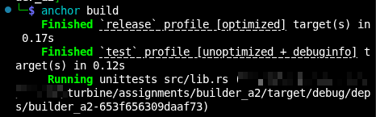
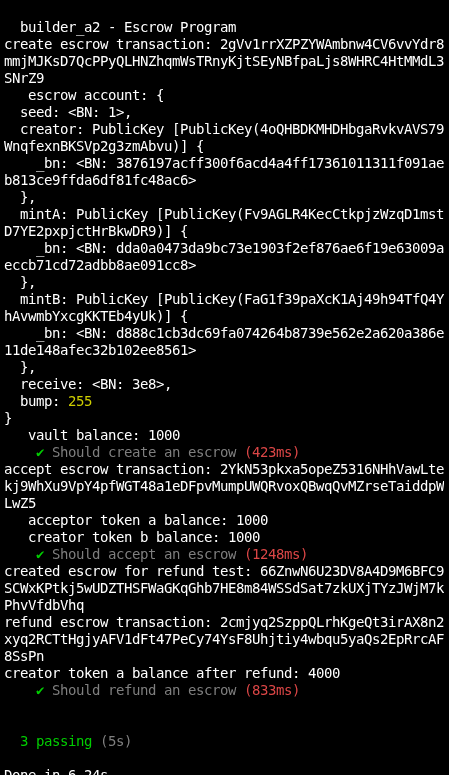

# Builders - Week 3 - Assignment 2

# Anchor Escrow

An Escrow is a vault account with a condition.
Functionalities of current escrow program;
- It creates an escrow account, accepts token A from creator puts it into escrow account
- An acceptor accepts the escrow and puts token B to the escrow and takes token A
- The creator gets token B and escrow account is closed
- If there is no acceptor, refund ensure whatever is in the escrow acount is sent to creator

---

# Architecture

```text
programs/builder_a2/src/
├── lib.rs                 
├── state.rs               
├── error.rs               
└── instructions/
    ├── mod.rs
    ├── create_escrow.rs   
    ├── accept_escrow.rs   
    └── refund_escrow.rs   
```

## File Overview

### lib.rs
Re-exports all the functionalities of escrow account;
create_escrow, accept_escrow, refund_escrow
using descriminators we mention the functionality of the escrow account

### state.rs
state contains the struct for Escrow account.
stores seed, who is the creator of escrow, mint token a and b, receieve amount, bump for PDA derivation

### error.rs
custom error handler
---

# Instructions

Contains instructions for escrow program.

## instructions/mod.rs
Re-exports all instructions for escrow.

## instructions/create_escrow.rs
Sets up new escrow account with trade terms, crates a token A ATA owned by escrow PDA, transfers token from creators wallet into the valut via CPI 'transfer_checked'

## instructions/accept_escrow.rs
Acceptrs sends token B to creator's ATA, creator receives token A from vault. then closes both vault and escrow account, use 'close' function that returns rent of escrow account back to creator.

## instructions/refund_escrow.rs
creator withdraws all tokens from the vault back to their ATA and closes both vault and escrow accounts, reclaiming rent via CPI with PDA signer seeds

---

# Tests

Tests are written in typescript.
---

# Results

## Build Passed Successfully



## Tests Passed Successfully


