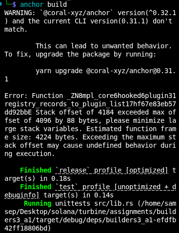
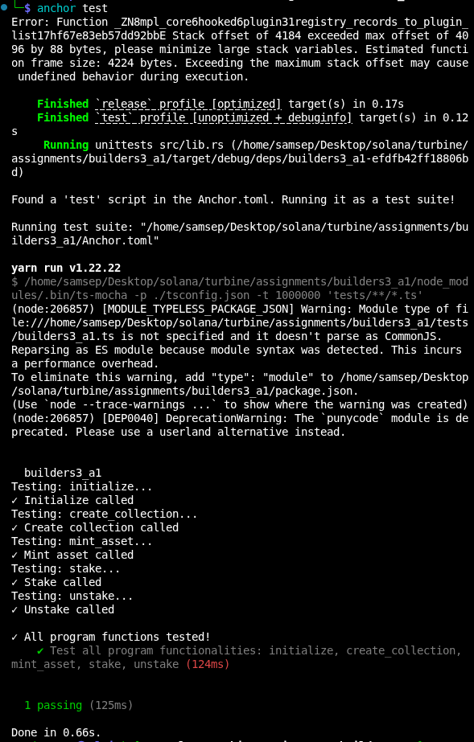

# Builders 3 - Week 1 - Assignment 1

# NFT Staking Program

An NFT staking program built with Anchor and Metaplex Core. Users stake NFTs from a managed collection to earn SPL token rewards proportional to their staking duration.

Functionalities of current staking program:
- Admin initializes a config account for a collection, setting the rewards rate (bps) and minimum freeze period
- Admin creates an MPL Core collection with a PDA-controlled update authority
- Users mint NFTs into the collection via a CPI to Metaplex Core
- Users stake an NFT - the asset is frozen and staking metadata is written via the Attributes plugin
- Users unstake an NFT after the freeze period - the asset is unfrozen, staking metadata is reset, and SPL rewards are minted proportional to days staked

---

# Architecture

```text
programs/builders3_a1/src/
├── lib.rs
├── state.rs
├── error.rs
└── instructions/
    ├── mod.rs
    ├── initialize.rs
    ├── create_collection.rs
    ├── mint_asset.rs
    ├── stake.rs
    └── unstake.rs
```

## File Overview

### lib.rs
Re exports all program modules and declares the five instruction entry points:
`initialize`, `create_collection`, `mint_asset`, `stake`, `unstake`.

### state.rs
Defines the `Config` PDA account. Stores `rewards_bps` (reward rate in basis points), `freeze_period` (minimum staking duration in days), and bumps for the config and rewards mint PDAs.

### error.rs
Custom error codes: `InvalidOwner`, `InvalidUpdateAuthority`, `AlreadyStaked`, `AssetNotStaked`, `InvalidTimestamp`, `FreezePeriodNotElapsed`, `InvalidRewardsBps`.

---

# Instructions

## instructions/initialize.rs
Admin creates the `Config` PDA and a rewards SPL token mint (seeded by the config address, owned by the config PDA). Validates that the caller is the collection's update authority before writing the rewards rate and freeze period.

## instructions/create_collection.rs
Creates a new Metaplex Core collection via `CreateCollectionV2CpiBuilder`. A PDA (`update_authority` seed + collection key) acts as the collection's update authority, giving the program exclusive control over collection management.

## instructions/mint_asset.rs
Mints a new NFT into the collection via `CreateV2CpiBuilder`. The PDA update authority signs the CPI, ensuring only this program can add assets to the collection. Metadata is immutable after mint (`update_authority(None)`).

## instructions/stake.rs
Validates the caller is the NFT owner and the NFT is not already staked. Writes `staked = true` and `staked_at = <unix_timestamp>` to the asset's Attributes plugin (adds the plugin if it doesn't exist yet, updates it otherwise). Freezes the asset using the FreezeDelegate plugin so it cannot be transferred while staked.

## instructions/unstake.rs
Validates the NFT is staked, calculates days staked, and enforces the configured freeze period. Unfreezes the asset (FreezeDelegate → `frozen: false`), resets the Attributes plugin (`staked = false`, `staked_at = 0`), then mints reward tokens to the owner's ATA.

Reward formula:
```
amount = staked_days × rewards_bps × 10^decimals / 10_000
```

---

# Tests

Tests are written in TypeScript.
Tests the the five instruction entry points:
`initialize`, `create_collection`, `mint_asset`, `stake`, `unstake`.

---

# Results

## Build Passed Successfully



## Tests Passed Successfully


