# Flush — Onchain Poker Protocol Architecture

## Legend

| Symbol / Style            | Meaning                                                |
| ------------------------- | ------------------------------------------------------ |
| 🟪 Rectangle              | On-chain account / PDA (program-owned state)           |
| 🟦 Rectangle              | Off-chain service (server, frontend)                   |
| 🟩 Rounded                | Instruction / process step                             |
| 🔶 Diamond                | Decision point (branching / validation)                |
| ⬡ Hexagon                 | Oracle (Switchboard VRF)                               |
| 🛢 Cylinder               | Database (Postgres / Valkey)                            |
| ☁️ Cloud                  | External managed service (Privy, Helius, Vercel)        |
| `──▶` solid arrow         | Control flow / instruction call                        |
| `╌╌▶` dashed arrow        | Data flow / event / read                               |
| **CPI**                   | Cross-Program Invocation                                |

---

## 0. Protocol Requirements

The protocol shall:

1. Allow an operator to **initialize a global config** (admin authority, rake
   basis points, treasury vault).
2. Allow a round to be **started with a unique `round_seed`** (each round is a
   distinct PDA).
3. Allow authenticated players (Privy embedded wallets) to **deposit SOL buy-in**
   into a per-round **pot vault**, creating a `PlayerSeat`.
4. Use a **Switchboard VRF** to generate verifiable randomness that deals
   **5 community/table cards** and **2 hole cards per player** from a 52-card deck.
5. Drive betting (check / call / raise / fold) across the four streets
   (pre-flop, flop, turn, river) — orchestrated by the game server, settled on-chain.
6. On round end, **evaluate the best 5-card hand**, split the pot between
   winner(s), and **charge a rake** to the treasury.
7. **Close** round/seat accounts and return rent once settled.
8. Run **all transactions in the background** — no user signing prompts — via
   Privy server-delegated signing.

---

## 1. System Context — End-to-End Architecture



*Figure 1 — System Context: end-to-end architecture*

Mermaid source

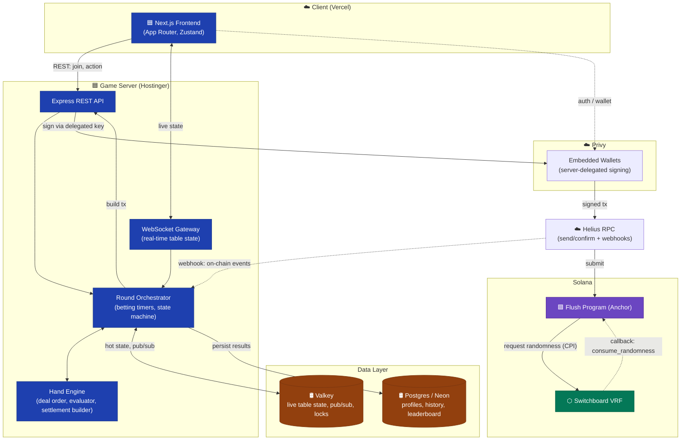
```mermaid
flowchart TB
    subgraph client["☁️ Client (Vercel)"]
        UI["🟦 Next.js Frontend<br/>(App Router, Zustand)"]
    end

    subgraph privy["☁️ Privy"]
        EW["Embedded Wallets<br/>(server-delegated signing)"]
    end

    subgraph srv["🟦 Game Server (Hostinger)"]
        EXP["Express REST API"]
        WS["WebSocket Gateway<br/>(real-time table state)"]
        ENG["Hand Engine<br/>(deal order, evaluator, settlement builder)"]
        ORCH["Round Orchestrator<br/>(betting timers, state machine)"]
    end

    subgraph data["Data Layer"]
        PG[("🛢 Postgres / Neon<br/>profiles, history, leaderboard")]
        VK[("🛢 Valkey<br/>live table state, pub/sub, locks")]
    end

    subgraph chain["Solana"]
        PROG["🟪 Flush Program (Anchor)"]
        VRF["⬡ Switchboard VRF"]
    end

    HEL["☁️ Helius RPC<br/>(send/confirm + webhooks)"]

    UI -->|"REST: join, action"| EXP
    UI <-->|"live state"| WS
    UI -.->|"auth / wallet"| EW

    EXP --> ORCH
    WS --> ORCH
    ORCH <--> ENG
    ORCH <-->|"hot state, pub/sub"| VK
    ORCH -->|"persist results"| PG

    ORCH -->|"build tx"| EXP
    EXP -->|"sign via delegated key"| EW
    EW -->|"signed tx"| HEL
    HEL -->|"submit"| PROG
    PROG -->|"request randomness (CPI)"| VRF
    VRF -.->|"callback: consume_randomness"| PROG
    HEL -.->|"webhook: on-chain events"| ORCH

    classDef chainNode fill:#6b46c1,stroke:#4c1d95,color:#fff;
    classDef svc fill:#1e40af,stroke:#1e3a8a,color:#fff;
    classDef db fill:#92400e,stroke:#78350f,color:#fff;
    classDef oracle fill:#047857,stroke:#065f46,color:#fff;
    class PROG chainNode;
    class VRF oracle;
    class UI,EXP,WS,ENG,ORCH svc;
    class PG,VK db;
```

**Separation of concerns**

- **On-chain (trust):** custody of funds (pot vault), verifiable randomness,
  authoritative settlement & rake.
- **Server (orchestration):** betting timers, turn order, hand evaluation,
  transaction construction, real-time fan-out. Holds **no custody** — it can
  only move funds through program instructions the players' delegated keys sign.
- **Data layer:** Postgres = durable record of truth for history/profiles;
  Valkey = ephemeral hot-path state and cross-instance pub/sub.

---

## 2. Program Structure & Account Model



*Figure 2 — Program structure & account model*

Mermaid source

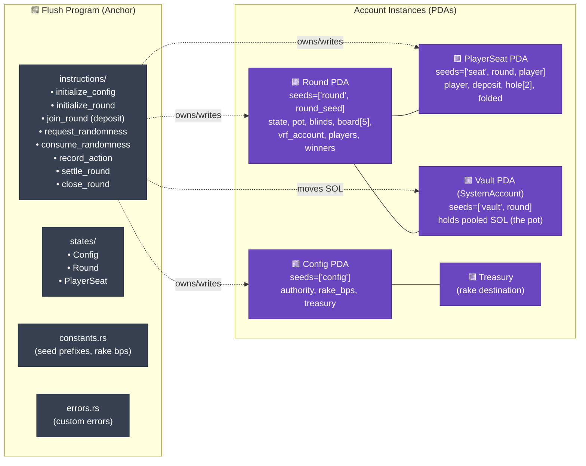
```mermaid
flowchart LR
    subgraph program["🟪 Flush Program (Anchor)"]
        direction TB
        IX["instructions/<br/>• initialize_config<br/>• initialize_round<br/>• join_round (deposit)<br/>• request_randomness<br/>• consume_randomness<br/>• record_action<br/>• settle_round<br/>• close_round"]
        ST["states/<br/>• Config<br/>• Round<br/>• PlayerSeat"]
        CO["constants.rs<br/>(seed prefixes, rake bps)"]
        ER["errors.rs<br/>(custom errors)"]
    end

    subgraph accounts["Account Instances (PDAs)"]
        direction TB
        CFG["🟪 Config PDA<br/>seeds=['config']<br/>authority, rake_bps, treasury"]
        RND["🟪 Round PDA<br/>seeds=['round', round_seed]<br/>state, pot, blinds, board[5],<br/>vrf_account, players, winners"]
        SEAT["🟪 PlayerSeat PDA<br/>seeds=['seat', round, player]<br/>player, deposit, hole[2], folded"]
        VAULT["🟪 Vault PDA (SystemAccount)<br/>seeds=['vault', round]<br/>holds pooled SOL (the pot)"]
        TREAS["🟪 Treasury<br/>(rake destination)"]
    end

    IX -. owns/writes .-> CFG
    IX -. owns/writes .-> RND
    IX -. owns/writes .-> SEAT
    IX -. moves SOL .-> VAULT
    RND --- VAULT
    RND --- SEAT
    CFG --- TREAS

    classDef chainNode fill:#6b46c1,stroke:#4c1d95,color:#fff;
    classDef mod fill:#374151,stroke:#1f2937,color:#fff;
    class CFG,RND,SEAT,VAULT,TREAS chainNode;
    class IX,ST,CO,ER mod;
```

### Account responsibilities

| Account        | Type / Owner          | Seeds                          | Key data                                                                                  |
| -------------- | --------------------- | ------------------------------ | ----------------------------------------------------------------------------------------- |
| **Config**     | PDA / Flush program   | `["config"]`                   | `authority`, `rake_bps`, `treasury`, `bump`                                                |
| **Round**      | PDA / Flush program   | `["round", round_seed]`        | `round_seed`, `state`, `pot`, `small_blind`, `big_blind`, `seat_count`, `board[5]`, `vrf_account`, `winners`, `created_at`, `bump` |
| **PlayerSeat** | PDA / Flush program   | `["seat", round_key, player]`  | `player`, `deposit`, `hole[2]`, `folded`, `all_in`, `bump`                                 |
| **Vault**      | PDA (SystemAccount)   | `["vault", round_key]`         | Pooled SOL = the pot; only program signs withdrawals                                       |
| **VRF**        | Switchboard-owned     | external                       | Randomness buffer; referenced by `Round.vrf_account`                                       |

### Round state machine



*Figure 3 — Round state machine*

Mermaid source

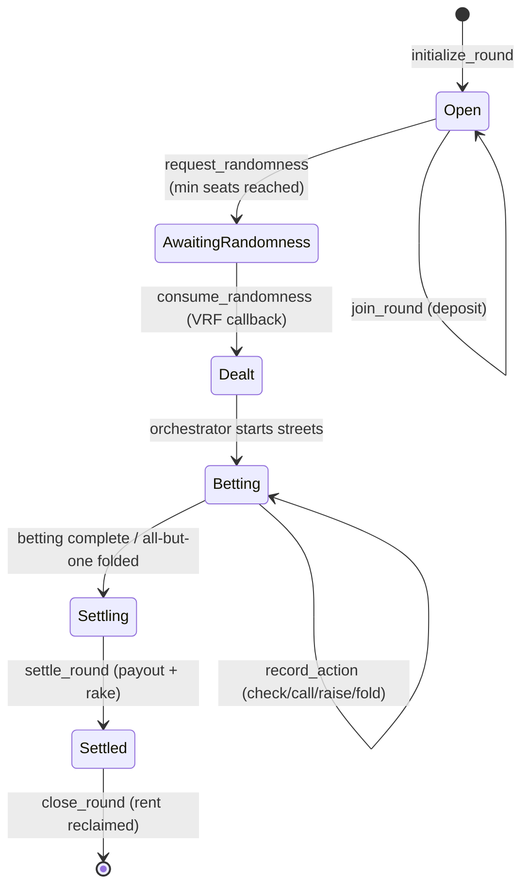
```mermaid
stateDiagram-v2
    [*] --> Open: initialize_round
    Open --> Open: join_round (deposit)
    Open --> AwaitingRandomness: request_randomness<br/>(min seats reached)
    AwaitingRandomness --> Dealt: consume_randomness (VRF callback)
    Dealt --> Betting: orchestrator starts streets
    Betting --> Betting: record_action (check/call/raise/fold)
    Betting --> Settling: betting complete / all-but-one folded
    Settling --> Settled: settle_round (payout + rake)
    Settled --> [*]: close_round (rent reclaimed)
```

---

## 3. PDA Derivation Map



*Figure 4 — PDA derivation map*

Mermaid source

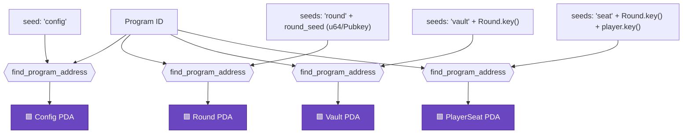
```mermaid
flowchart TB
    PID["Program ID"]

    PID --> D1{{"find_program_address"}}
    S1["seed: 'config'"] --> D1
    D1 --> CFG["🟪 Config PDA"]

    PID --> D2{{"find_program_address"}}
    S2["seeds: 'round' + round_seed (u64/Pubkey)"] --> D2
    D2 --> RND["🟪 Round PDA"]

    PID --> D3{{"find_program_address"}}
    S3["seeds: 'vault' + Round.key()"] --> D3
    D3 --> VAULT["🟪 Vault PDA"]

    PID --> D4{{"find_program_address"}}
    S4["seeds: 'seat' + Round.key() + player.key()"] --> D4
    D4 --> SEAT["🟪 PlayerSeat PDA"]

    classDef chainNode fill:#6b46c1,stroke:#4c1d95,color:#fff;
    class CFG,RND,VAULT,SEAT chainNode;
```

> `round_seed` is generated by the orchestrator per game (e.g. a monotonic
> counter or random u64 persisted in Postgres) so every round is a fresh,
> collision-free PDA.

---

## 4. End-to-End Round Lifecycle (Sequence)

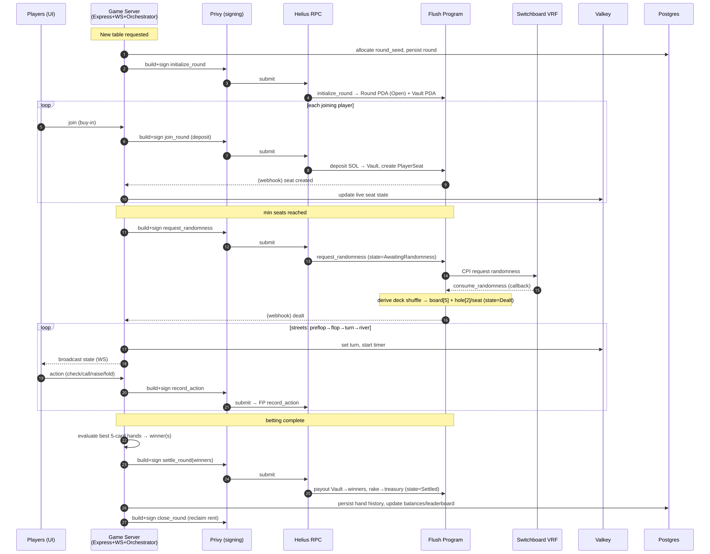

*Figure 5 — End-to-end round lifecycle (sequence)*

Mermaid source

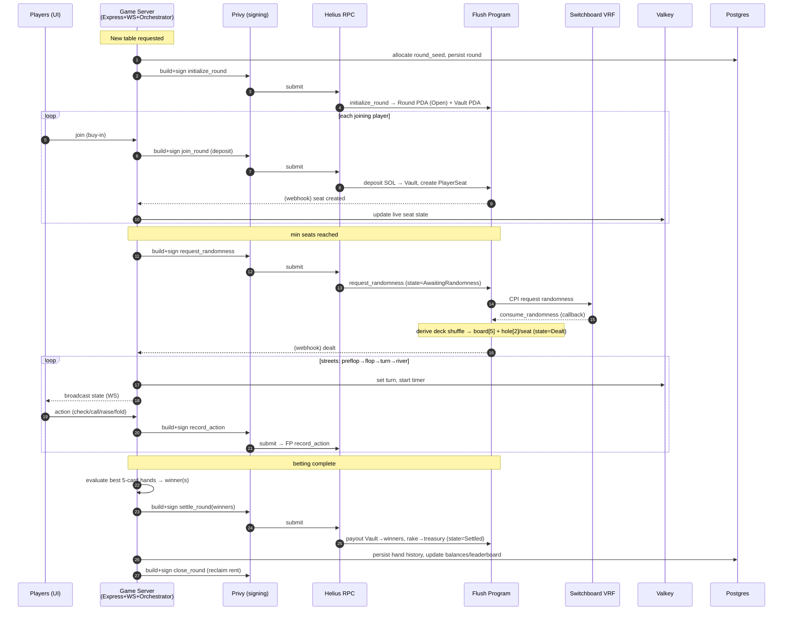
```mermaid
sequenceDiagram
    autonumber
    participant P as Players (UI)
    participant S as Game Server<br/>(Express+WS+Orchestrator)
    participant PV as Privy (signing)
    participant H as Helius RPC
    participant FP as Flush Program
    participant VR as Switchboard VRF
    participant VK as Valkey
    participant PG as Postgres

    Note over S: New table requested
    S->>PG: allocate round_seed, persist round
    S->>PV: build+sign initialize_round
    PV->>H: submit
    H->>FP: initialize_round → Round PDA (Open) + Vault PDA

    loop each joining player
        P->>S: join (buy-in)
        S->>PV: build+sign join_round (deposit)
        PV->>H: submit
        H->>FP: deposit SOL → Vault, create PlayerSeat
        FP-->>S: (webhook) seat created
        S->>VK: update live seat state
    end

    Note over S,FP: min seats reached
    S->>PV: build+sign request_randomness
    PV->>H: submit
    H->>FP: request_randomness (state=AwaitingRandomness)
    FP->>VR: CPI request randomness
    VR-->>FP: consume_randomness (callback)
    Note over FP: derive deck shuffle → board[5] + hole[2]/seat (state=Dealt)
    FP-->>S: (webhook) dealt

    loop streets: preflop→flop→turn→river
        S->>VK: set turn, start timer
        S-->>P: broadcast state (WS)
        P->>S: action (check/call/raise/fold)
        S->>PV: build+sign record_action
        PV->>H: submit → FP record_action
    end

    Note over S,FP: betting complete
    S->>S: evaluate best 5-card hands → winner(s)
    S->>PV: build+sign settle_round(winners)
    PV->>H: submit
    H->>FP: payout Vault→winners, rake→treasury (state=Settled)
    S->>PG: persist hand history, update balances/leaderboard
    S->>PV: build+sign close_round (reclaim rent)
```

---

## 5. Instruction Flowcharts

### 5.1 `initialize_round`



*Figure 6 — initialize_round*

Mermaid source

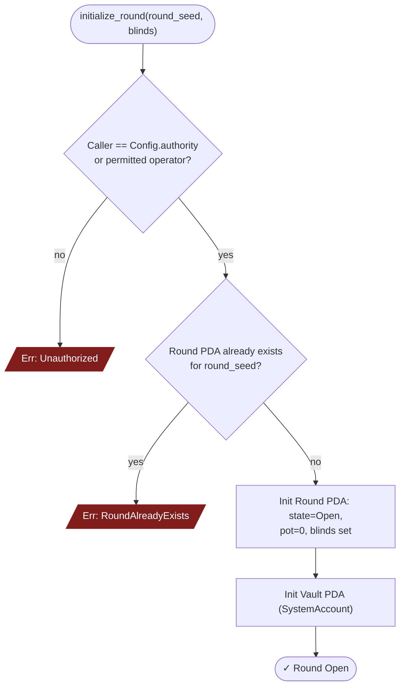
```mermaid
flowchart TB
    A(["initialize_round(round_seed, blinds)"]) --> B{Caller == Config.authority<br/>or permitted operator?}
    B -- no --> E1[/"Err: Unauthorized"/]
    B -- yes --> C{Round PDA already exists<br/>for round_seed?}
    C -- yes --> E2[/"Err: RoundAlreadyExists"/]
    C -- no --> D["Init Round PDA: state=Open,<br/>pot=0, blinds set"]
    D --> F["Init Vault PDA (SystemAccount)"]
    F --> G(["✓ Round Open"])

    classDef err fill:#7f1d1d,stroke:#991b1b,color:#fff;
    class E1,E2 err;
```

### 5.2 `join_round` (deposit buy-in)



*Figure 7 — join_round (deposit buy-in)*

Mermaid source

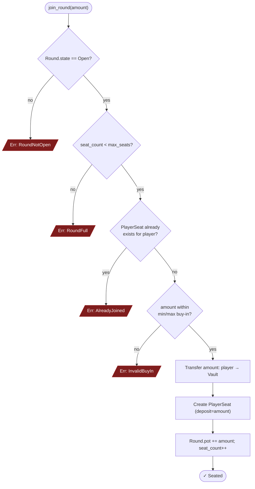
```mermaid
flowchart TB
    A(["join_round(amount)"]) --> B{Round.state == Open?}
    B -- no --> E1[/"Err: RoundNotOpen"/]
    B -- yes --> C{seat_count < max_seats?}
    C -- no --> E2[/"Err: RoundFull"/]
    C -- yes --> D{PlayerSeat already<br/>exists for player?}
    D -- yes --> E3[/"Err: AlreadyJoined"/]
    D -- no --> F{amount within<br/>min/max buy-in?}
    F -- no --> E4[/"Err: InvalidBuyIn"/]
    F -- yes --> G["Transfer amount: player → Vault"]
    G --> H["Create PlayerSeat (deposit=amount)"]
    H --> I["Round.pot += amount; seat_count++"]
    I --> J(["✓ Seated"])

    classDef err fill:#7f1d1d,stroke:#991b1b,color:#fff;
    class E1,E2,E3,E4 err;
```

### 5.3 `request_randomness` → `consume_randomness` (card dealing)



*Figure 8 — request_randomness → consume_randomness (card dealing)*

Mermaid source

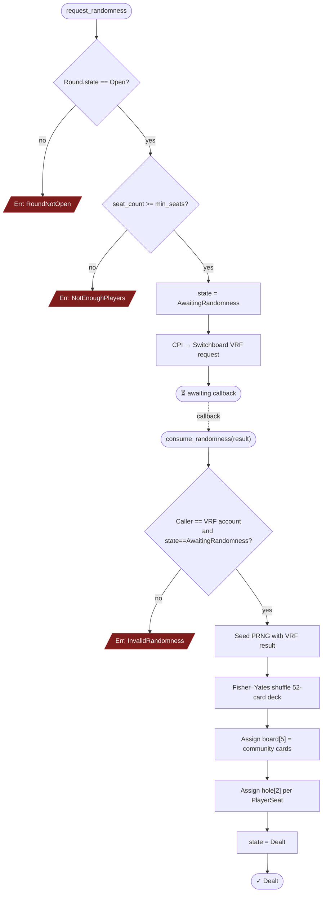
```mermaid
flowchart TB
    A(["request_randomness"]) --> B{Round.state == Open?}
    B -- no --> E1[/"Err: RoundNotOpen"/]
    B -- yes --> C{seat_count >= min_seats?}
    C -- no --> E2[/"Err: NotEnoughPlayers"/]
    C -- yes --> D["state = AwaitingRandomness"]
    D --> F["CPI → Switchboard VRF request"]
    F --> G(["⏳ awaiting callback"])

    G -.callback.-> H(["consume_randomness(result)"])
    H --> I{Caller == VRF account<br/>and state==AwaitingRandomness?}
    I -- no --> E3[/"Err: InvalidRandomness"/]
    I -- yes --> J["Seed PRNG with VRF result"]
    J --> K["Fisher–Yates shuffle 52-card deck"]
    K --> L["Assign board[5] = community cards"]
    L --> M["Assign hole[2] per PlayerSeat"]
    M --> N["state = Dealt"]
    N --> O(["✓ Dealt"])

    classDef err fill:#7f1d1d,stroke:#991b1b,color:#fff;
    class E1,E2,E3 err;
```

> **Card-privacy note:** hole cards written on-chain are world-readable. Options
> to document/decide: (a) accept transparency for a fully-onchain POC, or
> (b) store only a **commitment/hash** on-chain and reveal at showdown, with the
> server holding the deal order keyed by the VRF result. The diagram shows the
> transparent variant; the commitment variant adds a `reveal` step at settlement.

### 5.4 `record_action` (betting)



*Figure 9 — record_action (betting)*

Mermaid source

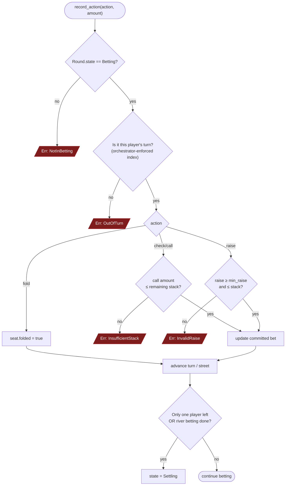
```mermaid
flowchart TB
    A(["record_action(action, amount)"]) --> B{Round.state == Betting?}
    B -- no --> E1[/"Err: NotInBetting"/]
    B -- yes --> C{"Is it this player's turn?<br/>(orchestrator-enforced index)"}
    C -- no --> E2[/"Err: OutOfTurn"/]
    C -- yes --> D{action}
    D -- fold --> F["seat.folded = true"]
    D -- check/call --> G{call amount<br/>≤ remaining stack?}
    D -- raise --> H{raise ≥ min_raise<br/>and ≤ stack?}
    G -- no --> E3[/"Err: InsufficientStack"/]
    H -- no --> E4[/"Err: InvalidRaise"/]
    G -- yes --> I["update committed bet"]
    H -- yes --> I
    F --> J["advance turn / street"]
    I --> J
    J --> K{Only one player left<br/>OR river betting done?}
    K -- yes --> L["state = Settling"]
    K -- no --> M(["continue betting"])

    classDef err fill:#7f1d1d,stroke:#991b1b,color:#fff;
    class E1,E2,E3,E4 err;
```

> Betting may be modeled **off-chain first** (Valkey hot state) for latency, with
> only the net result settled on-chain — or each action recorded on-chain for full
> verifiability. This is a key **trust-vs-cost decision point** to confirm.

### 5.5 `settle_round` (payout + rake)



*Figure 10 — settle_round (payout + rake)*

Mermaid source

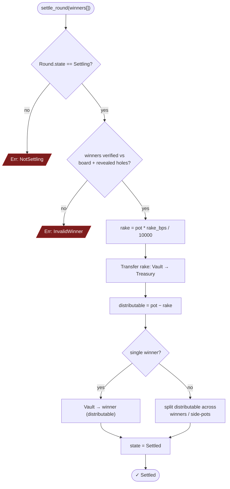
```mermaid
flowchart TB
    A(["settle_round(winners[])"]) --> B{Round.state == Settling?}
    B -- no --> E1[/"Err: NotSettling"/]
    B -- yes --> C{winners verified vs<br/>board + revealed holes?}
    C -- no --> E2[/"Err: InvalidWinner"/]
    C -- yes --> D["rake = pot * rake_bps / 10000"]
    D --> F["Transfer rake: Vault → Treasury"]
    F --> G["distributable = pot − rake"]
    G --> H{single winner?}
    H -- yes --> I["Vault → winner (distributable)"]
    H -- no --> J["split distributable across<br/>winners / side-pots"]
    I --> K["state = Settled"]
    J --> K
    K --> L(["✓ Settled"])

    classDef err fill:#7f1d1d,stroke:#991b1b,color:#fff;
    class E1,E2 err;
```

### 5.6 `close_round` / `close_seat`



*Figure 11 — close_round / close_seat*

Mermaid source

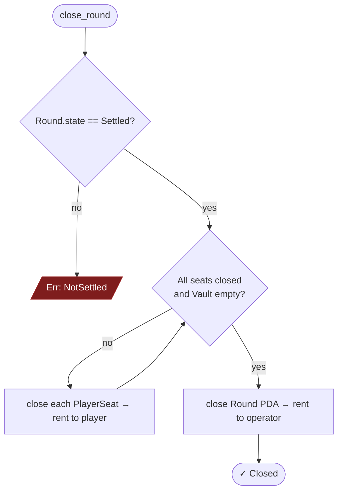
```mermaid
flowchart TB
    A(["close_round"]) --> B{Round.state == Settled?}
    B -- no --> E1[/"Err: NotSettled"/]
    B -- yes --> C{All seats closed<br/>and Vault empty?}
    C -- no --> D["close each PlayerSeat → rent to player"]
    D --> C
    C -- yes --> F["close Round PDA → rent to operator"]
    F --> G(["✓ Closed"])

    classDef err fill:#7f1d1d,stroke:#991b1b,color:#fff;
    class E1 err;
```

---

## 6. Randomness (VRF) Flow — Detail

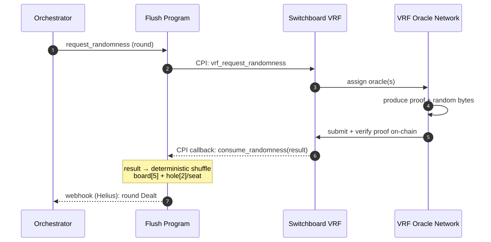

*Figure 12 — VRF randomness flow (detail)*

Mermaid source

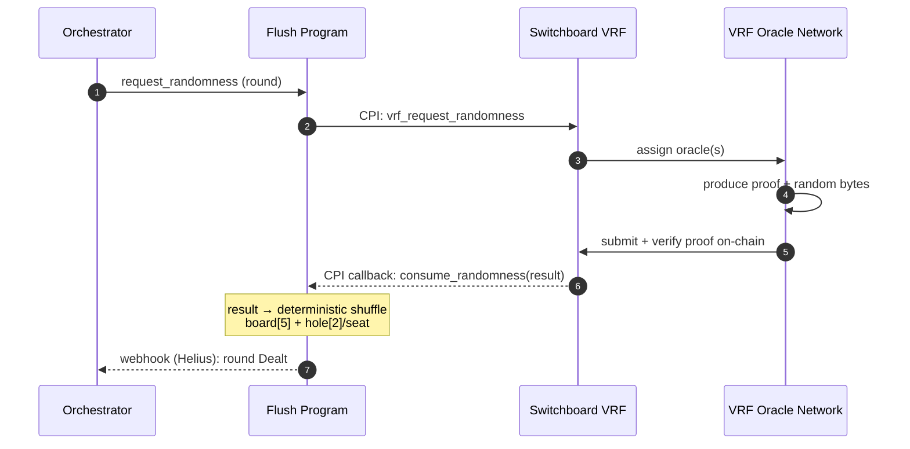
```mermaid
sequenceDiagram
    autonumber
    participant S as Orchestrator
    participant FP as Flush Program
    participant SB as Switchboard VRF
    participant O as VRF Oracle Network

    S->>FP: request_randomness (round)
    FP->>SB: CPI: vrf_request_randomness
    SB->>O: assign oracle(s)
    O->>O: produce proof + random bytes
    O->>SB: submit + verify proof on-chain
    SB-->>FP: CPI callback: consume_randomness(result)
    Note over FP: result → deterministic shuffle<br/>board[5] + hole[2]/seat
    FP-->>S: webhook (Helius): round Dealt
```

**Why VRF:** the deck order is provably unpredictable and verifiable — no party
(server or player) can know or bias the deal before the oracle commits.

---

## 7. Data Placement — Postgres vs Valkey



*Figure 13 — Data placement: Postgres vs Valkey*

Mermaid source

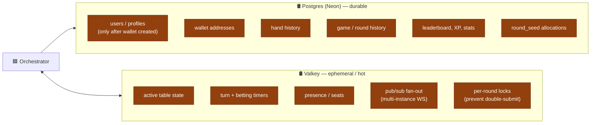
```mermaid
flowchart LR
    subgraph PG["🛢 Postgres (Neon) — durable"]
        U["users / profiles<br/>(only after wallet created)"]
        W["wallet addresses"]
        HH["hand history"]
        GH["game / round history"]
        LB["leaderboard, XP, stats"]
        RS["round_seed allocations"]
    end

    subgraph VK["🛢 Valkey — ephemeral / hot"]
        TS["active table state"]
        TURN["turn + betting timers"]
        PRES["presence / seats"]
        PUBSUB["pub/sub fan-out<br/>(multi-instance WS)"]
        LOCK["per-round locks<br/>(prevent double-submit)"]
    end

    ORCH["🟦 Orchestrator"] --> PG
    ORCH <--> VK

    classDef db fill:#92400e,stroke:#78350f,color:#fff;
    class U,W,HH,GH,LB,RS,TS,TURN,PRES,PUBSUB,LOCK db;
```

- **Postgres** is the durable source of truth; profiles are persisted **only
  after** a Privy wallet exists (per the product rule).
- **Valkey** holds nothing that can't be rebuilt from chain + Postgres; it exists
  for latency and to coordinate WebSocket instances behind a load balancer.

---

## 8. Background Signing (Privy) — No User Prompts



*Figure 14 — Background signing (Privy), no user prompts*

Mermaid source

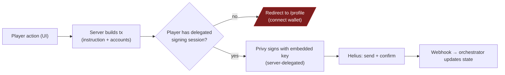
```mermaid
flowchart LR
    A["Player action (UI)"] --> B["Server builds tx<br/>(instruction + accounts)"]
    B --> C{Player has delegated<br/>signing session?}
    C -- no --> D[/"Redirect to /profile<br/>(connect wallet)"/]
    C -- yes --> E["Privy signs with embedded key<br/>(server-delegated)"]
    E --> F["Helius: send + confirm"]
    F --> G["Webhook → orchestrator updates state"]

    classDef err fill:#7f1d1d,stroke:#991b1b,color:#fff;
    class D err;
```

> Funded embedded wallet + delegated session ⇒ every poker action is just a
> background transaction (feels like "game points"). Only **authenticated, funded**
> users can play cash games; otherwise they're routed to `/profile`.
